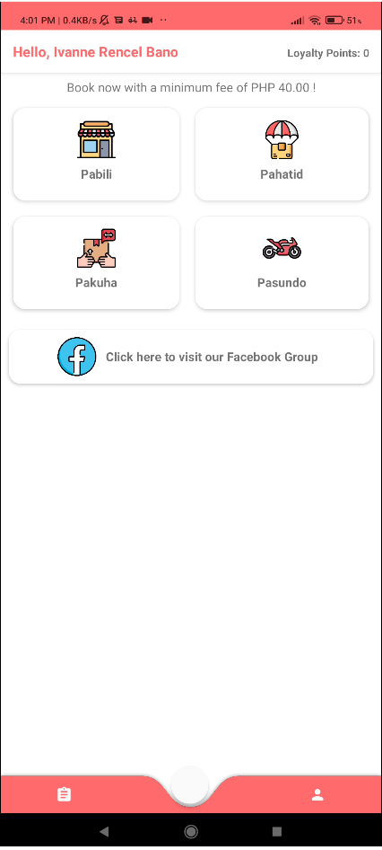

# Muñoz Express Android

Muñoz Express Android is the client side for our thesis project.
 It manage the creating and completing of transactions through user and rider accounts.
 
 ## Customer Side Screenshots

       

 
 ## Rider Side Screenshots

       

## Features

- Firebase SMS Authentication
- Firebase Storage
- Creating of User Accounts
- Creating New transactions
- Show maps via mapboxs
- Show estimated distance, price, and duration of a transactions
- Navigate a chosen location via rider

## Built with

- Android Studio Java
- Mapbox API
- Firebase

